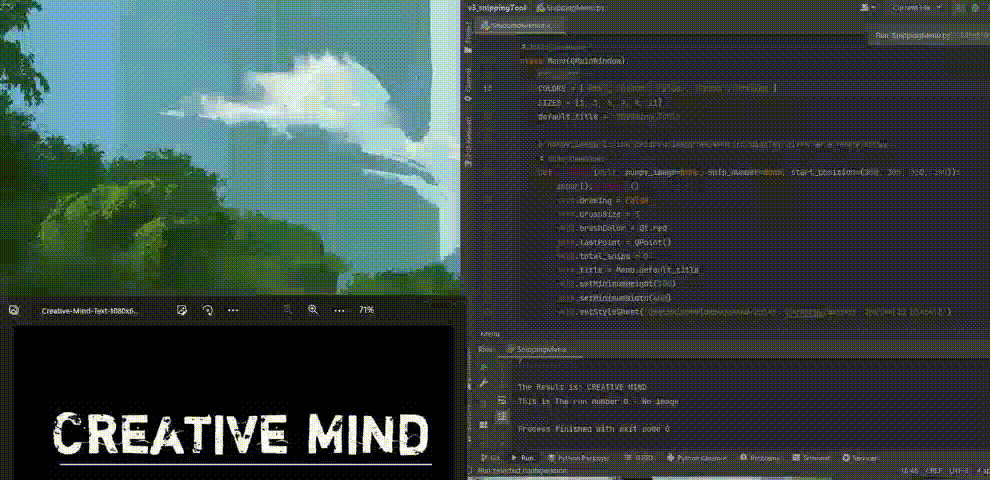

# OCR Snipping Tool
<div align="center">


</div>

A Snipping tool With OCR functionality.<br><br>


<br>
The purpose of this program is to provide the following functionality:

1.    Extract copy/pastable text from a snipped image.
2.    Save screen snippets.


## Build with
<h3 align="left">Languages and Tools:</h3>
<p align="left">
<a href="https://www.python.org/"> </a>
<a href="https://cloud.google.com/vision"> </a> 
<a href="https://www.qt.io/"> </a>
</p>


# Running the Program

First, verify python is installed By Running

```shell
python --version
```
Second, Open a Virtual environment and install all packages.<br><br>
**TIP** : If you got pycharm it is a great option as it is very easy so set a virtual environment .<br><br>

Use the requirements.txt file to speed up the progress.
<br>

```shell
pip install -r /path/to/requirements.txt
```

### Get into Your GPC Console 

https://console.cloud.google.com/

1. Go Into "Apis & Services"
<br>
2. Search for vision
<br>
3. Enable The Cloud vision API

### Set Up Authentication - Getting The Json API key


<br>
Here the Instructions From google-docs : <br>
Link To <br>
[Docs](https://cloud.google.com/vision/docs/libraries#setting_up_authentication)
<br>


After You Download the key rename it to :
```shell
ServiceAccountToken.json
```
Put This File inside your /venv/ directory.
This is the path that the file need to be in so the program will work.

## Change The following variable in handWriteRecognizion.py
Folder_PATH >> Your current project folder
Set the value FOLDER_PATH To your current project directory Path


## Credits
A great Snipping Tool From The legend "harupy". <br>
Link To Repo Link: https://github.com/harupy/snipping-tool)
