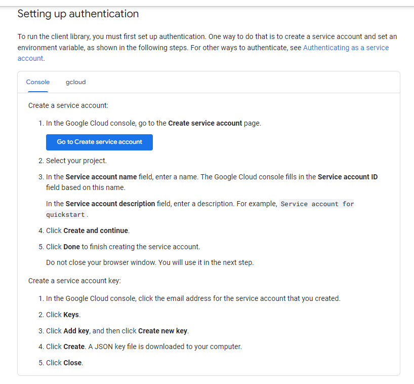

# OCR Snipping Tool
<div align="center">


</div>

A Snipping tool With OCR functionality.<br>
This Program Can:

1. Get copy/pastable text from snipped Image
2. screen snippet + save


# Running the Program

First, verify python is installed 


```shell
python --version
```
Open a Virtual Enviroment and intall all packages, if you got pycharm it is a great option.
Use the requirments.txt file to speed up the progress
```shell
pip install -r /path/to/requirements.txt
```

Get into Your GPC Console 

https://console.cloud.google.com/

1. Go Into "Apis & Services"
<br>
2. Search for vision
<br>
3. Enable The Cloud vision API

<br>
Set Up authentication<br>
Here the Instructions From google-docs : <br>
Link To <br>
[Docs](https://cloud.google.com/vision/docs/libraries#setting_up_authentication)
<br>


After You Download the key rename it to :
```shell
ServiceAccountToken.json
```
Put This File inside you venv dir.
This is the path that was defined in the module.

[//]: # (Tools Used In Project)

[//]: # (1.Google-VisionAPI)

[//]: # (2.Pyqt5 Library)

[//]: # (3.Snipping Tool From The legend "harupy" Git Hun Repo Link: https://github.com/harupy/snipping-tool)
